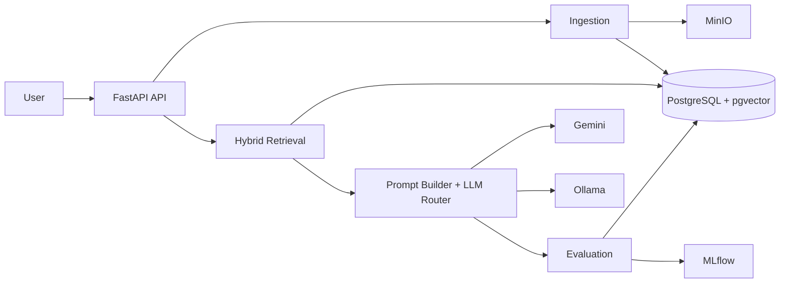
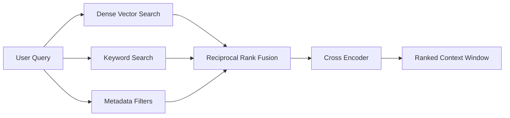

# System Architecture

## 1. Overview

This project implements a production-inspired Retrieval-Augmented Generation (RAG) system capable of ingesting multiple document formats, retrieving relevant context through hybrid search, generating grounded responses using Large Language Models (LLMs), continuously evaluating response quality, and supporting future model fine-tuning.

The architecture separates responsibilities into five independent subsystems:

- Ingestion
- Retrieval
- Generation
- Evaluation
- Fine-Tuning

The design emphasizes modularity, scalability, and maintainability while keeping the implementation lightweight enough for a university project.

---

## 2. Technology Stack

| Layer | Technology |
|--------|------------|
| Backend | FastAPI |
| Authentication | JWT |
| Database | PostgreSQL + pgvector |
| Object Storage | MinIO |
| Cache (Optional) | Redis |
| Embedding Model | BAAI/bge-small-en-v1.5 |
| LLM | Gemini (Primary), Ollama (Fallback) |
| Retrieval | Hybrid Search + RRF + Cross Encoder |
| Monitoring | Prometheus + Grafana |
| Experiment Tracking | MLflow |

---

## 3. Design Principles

The architecture is designed around the following principles:

- Modular subsystems with clear responsibilities
- Separation of storage, retrieval, and generation
- Support for multiple document types
- Hybrid retrieval for improved accuracy
- Continuous quality evaluation
- Production-ready components with minimal implementation complexity

Some services such as Redis, Prometheus, Grafana, and MLflow are included as production-oriented extensions and may be omitted in an initial implementation.

---

# 4. Overall Architecture

---

# 5. Ingestion Subsystem

### Purpose

Convert raw documents into searchable vector representations.

### Supported Inputs

- PDF
- DOCX
- Images (OCR)
- CSV
- Web URLs

### Workflow

1. User uploads a document or URL.
2. Raw files are stored in MinIO.
3. Content is extracted according to file type.
4. Documents are semantically chunked.
5. Embeddings are generated using **BAAI/bge-small-en-v1.5**.
6. Chunks, metadata, and vectors are stored in PostgreSQL with pgvector.

### Responsibilities

- File validation
- Text extraction
- Chunk generation
- Embedding generation
- Metadata persistence

### Failure Handling

- Unsupported file formats are rejected.
- OCR failures are logged.
- Partial ingestion jobs can be retried safely.

---

# 6. Retrieval Subsystem

### Purpose

Retrieve the most relevant context for a user query before generation.

### Retrieval Pipeline

### Components

- Dense embedding similarity search
- Keyword (BM25) retrieval
- Metadata filtering
- Reciprocal Rank Fusion (RRF)
- Cross-encoder reranking

This hybrid approach improves robustness compared to relying solely on vector similarity.

---

# 7. Generation Subsystem

### Purpose

Generate grounded responses using retrieved context.

### Workflow

1. Receive ranked context window.
2. Assemble prompt.
3. Route request to the appropriate model.
4. Stream generated response.
5. Log prompt, retrieved context, and completion.

### Model Routing

Primary model:

- Gemini

Fallback:

- Ollama (local)

Routing may later consider latency, cost, or domain-specific models.

---

# 8. Evaluation Subsystem

### Purpose

Measure answer quality continuously without blocking user requests.

### Metrics

- Faithfulness
- Answer Relevance
- Context Precision
- Context Recall

Evaluation runs asynchronously after each response.

Scores are stored in PostgreSQL and used to compute rolling quality metrics.

---

# 9. Fine-Tuning Subsystem

### Purpose

Continuously improve future model performance.

Only responses satisfying:

- Faithfulness > 0.8
- User Rating ≥ 4

are selected.

Selected examples are:

- converted to JSONL
- tracked with MLflow
- submitted for fine-tuning
- registered for future deployment

The serving layer may route similar future requests to the fine-tuned model if it consistently outperforms the base model.

---

# 10. Security

- JWT authentication
- Role-based authorization
- HTTPS in production
- Secure object storage
- Metadata validation
- Request rate limiting

---

# 11. Scalability

The architecture supports horizontal scaling through:

- Stateless FastAPI services
- PostgreSQL indexing
- Redis query caching
- Independent ingestion workers
- Background evaluation jobs
- External object storage

---

# 12. Future Enhancements

- Multi-modal embeddings
- Distributed ingestion workers
- Multi-tenant support
- Automatic prompt optimization
- Active learning for fine-tuning
- Advanced observability dashboards